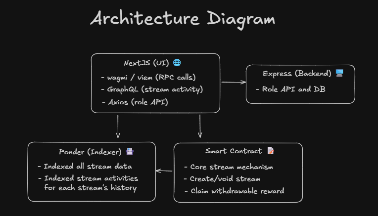
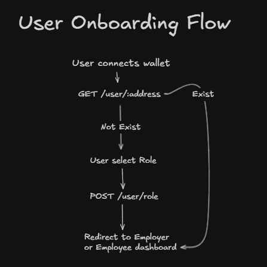
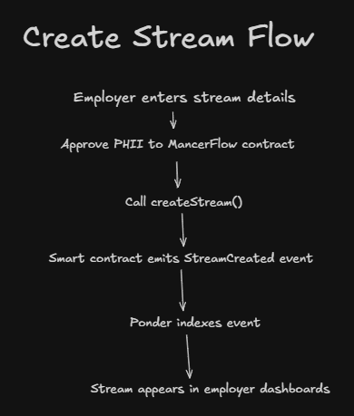
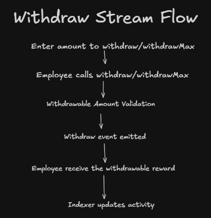
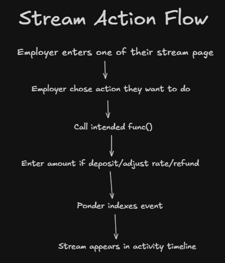

# Mancer Flow System Design

### Overview

Mancer Flow is a streaming payment dApp that allows:

- Employers → create and fund salary/payment streams

- Employees → receive funds continuously and withdraw anytime

- Powered by smart contracts on EDU Chain with off-chain indexing + role management

## Architecture Diagram

## Flow

### User Onboarding Flow

### Create Stream Flow

### Withdraw Stream Flow

### Stream Action Flow

